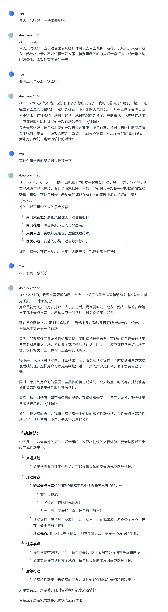

# 深度学习课程作业——大模型微调 #

本次作业实现的是调整`deepseek-r1:1.5b`对话风格，以更符合微信聊天，技术路线使用Llama-factory作为微调框架，数据来源于本人的微信聊天，为了更好地可视化模型微调效果，还配置UI界面，使大模型可支持图形化对话交互。接下来将从这三方面进行详细说明。

## 数据准备及预处理 ##

### 微信聊天数据导出 ###

首先需要导出相应的微信聊天数据，本次作业采用了第三方工具[留痕](https://github.com/LC044/WeChatMsg)，通过该工具导出的数据格式如下：


上图展示了使用第三方工具导出的文件结构，每个文件夹包含相应联系人的聊天信息


上图展示了文件夹中包含的内容，主要文件包括`dev`测试集以及`train`数据集，其中包含了`json`格式的聊天数据，部分数据如下所示：


该格式是`sharegpt`数据格式的变种，以符合微调`Qwen`系列模型要求的数据格式。此外导出的数据文件由于都是按联系人列出的，因此需要写脚本将这些json格式的数据文件进行合并，以满足微调数据量要求。

### 微信聊天数据增强 ###

从微信导出的聊天数据通常都是日常聊天，缺乏上下文连贯性，非常无厘头，直接用导出的数据进行微调效果不佳，因此需要预处理以使上下文连贯，改善微调效果。本次作业利用阿里云百炼大模型平台提供的`api`，调用的大模型为`qwen2.5-32b-instruct`，该模型擅长处理`json`格式的数据，调用处理代码如下：
``` python
import os
import json
from openai import OpenAI

try:
    client = OpenAI(
        # 若没有配置环境变量，请用百炼API Key将下行替换为：api_key="sk-xxx",
        api_key=os.getenv("DASHSCOPE_API_KEY"),
        base_url="https://dashscope.aliyuncs.com/compatible-mode/v1",
    )
    
    # 1. 读取包含多个对话单元的JSON文件
    with open("./data/train.json", "r", encoding="utf-8") as f:
        incomplete_chat = json.load(f)
    
    output_data = []
    # 遍历处理每个对话单元
    for index, chat_unit in enumerate(incomplete_chat):
        if index>80:
            conversations = chat_unit["conversations"]
        
            # 分离系统提示和对话内容
            system_prompts = [msg for msg in conversations if msg["role"] == "system"]
            dialogue_messages = [msg for msg in conversations if msg["role"] in ("user", "assistant")]
    
            # 将原始聊天数据转换为 JSON 字符串
            dialogue_messages = json.dumps(dialogue_messages, ensure_ascii=False)
    
            # 构造提示词，包含原始数据和详细的任务指令
            prompt_instructions = f"""
                {dialogue_messages}
    
                上面是发生在朋友、同学、亲人或者陌生好友微信里的日常聊天对话的一个片段，该对话不完整。(注意：类似"[玫瑰]"这种是微信里的一种文字表情，代表说话人的心情或者状态，你也可以使用这些来丰富对话)
                你的任务是添加两个人聊天话题的开始对话，补充一些内容使修改后的对话更加连贯、通顺。
                并续写这段聊天对话，为了聊天对话的完整性，你可以删除或修改部分内容，使聊天更加完整、丰富、有始有终、具有连贯性、问答的相关性、话题的衔接性。
                你只需要模仿聊天对话里的语气即可、注意讲话必须是具有很高的拟人度，符合人类日常说话习惯，对于"assistant"讲话比较少的内容可以适当扩充一些，看起来更完整。
                输出格式与原格式相同必须是JSON列表格式，对话必须以"user"开始，必须以"assistant"结束，输出结果可以直接被解析成JSON，
                **避免长篇大论，保持日常聊天风格**
                **不要用嘿！、嗨！这种开头**
                **不要有无关输出!!!**，**不要有无关输出!!!**，**不要有无关输出!!!**
                """

            # 调用模型进行对话续写
            completion = client.chat.completions.create(
                # 模型列表请参见：https://help.aliyun.com/zh/model-studio/getting-started/models
                model="qwen2.5-32b-instruct",
                messages=[
                    {"role": "system", "content": prompt_instructions},
                    {"role": "user", "content": "请根据上面的聊天片段进行补充和续写，在原有对话基础上补充2-3轮，使其连贯完整"}
                ]
            )
        
            # 处理结果
            try:
                new_dialogue = json.loads(completion.choices[0].message.content)
                
                # 构建完整的对话单元（保留原始系统消息 + 新生成的对话）
                processed_unit = {
                    "conversations": system_prompts + new_dialogue
                }
                output_data.append(processed_unit)
                
                print(f"成功处理第 {index+1} 条对话")
            except json.JSONDecodeError:
                print(f"⚠️ 第 {index+1} 条对话输出格式异常，已保留原始数据")
                output_data.append(chat_unit)  # 保留原始数据

            # 保存结果到文件
            with open("./train.json", "w", encoding="utf-8") as f:
                json.dump(output_data, f, indent=2, ensure_ascii=False)
                print("\n处理完成！结果已保存到 ./train_2.json")
            
except Exception as e:
    print(f"错误信息：{e}")
    print("请参考文档：https://help.aliyun.com/zh/model-studio/developer-reference/error-code")
```

本次作业在改善原始数据的上下文连贯性时，设计了比较详细的提示词。通过以上处理，微调前的数据准备工作已经大致完成，接下来将详细介绍微调过程的具体步骤。

## 基于LLama-factory进行模型微调 ##

### deepseek-r1:1.5b模型微调 ###
通过`LLama-factory`这一框架可以实现大模型的低代码微调，操作界面大致如下，


首先加载需要微调的模型`deepseek-r1:1.5b`，该模型需要从[HuggingFace](https://hf-mirror.com/)上拉取镜像，下载好后即可导入；

随后需要导入准备好的数据集，一方面需要将数据集放到`/LLaMA-Factory/data`目录下；另一方面需要修改`/LLaMA-Factory/data`目录下的文件`dataset_info.json`，增加如下代码：

```json
"wechat_info_train": {
    "file_name": "small_train.json",
    "formatting": "sharegpt",
    "columns": {
      "messages": "conversations"
    },
    "tags": {
      "role_tag": "role",
      "content_tag": "content",
      "user_tag": "user",
      "assistant_tag": "assistant",
      "system_tag": "system"
    }
  },
```

对于微调参数，本次课程作业采用官方文档推荐的参数，接下来即可开始微调。

### deepseek-r1:1.5b模型导出 ###

微调好后可以导出模型，不过需要注意的是通过`LLaMA-Factory`导出的模型与`Ollama`所需格式有区别，需要借助`Llama.cpp`的代码进行转换。

为了使在`LLama-factory`中微调的模型能够在`Ollama`中部署，需要先获取微调模型的`safetensors`格式文件，该文件可由`LLama-factory`导出后获得;随后需要将`safetensors`格式转换为`gguf`格式，该步骤可通过如下代码实现(需要先配置好`LLama.cpp`工具环境)：
``` bash
 python convert_hf_to_gguf.py /home/qlong01/.cache/modelscope/hub/models/deepseek-r1_tune:1.5b\model.safetensors \
 --outfile /home/qlong01/.cache/modelscope/hub/models/deepseek-r1_tune:1.5b\Deepseek-R1_Tune:1.5B-1.8B-Q4_K_M.gguf \
 --outtype Q4_K_M 
```
最后有了`gguf`格式的模型文件，即可利用`Ollama`进行部署，在利用`Ollama`之前，需要先编写`Modelfile`文件，代码如下：

``` 
# ollama modelfile auto-generated by llamafactory

FROM ./Deepseek-R1_Tune:1.5B-1.8B-Q4_K_M.gguf

TEMPLATE """<｜begin▁of▁sentence｜>{{ if .System }}{{ .System }}{{ end }}{{ range .Messages }}{{ if eq .Role "user" }}<｜User｜>{{ .Content }}<｜Assistant｜>{{ else if eq .Role "assistant" }}{{ .Content }}<｜end▁of▁sentence｜>{{ end }}{{ end }}"""

PARAMETER stop "<｜end▁of▁sentence｜>"
PARAMETER num_ctx 4096
```

利用`Modelfile`文件，使用如下代码，`Ollama`可以部署对应的模型:

``` bash
ollama create model_name -f /path/to/Modelfile
```

通过以上步骤，可以基本实现对大模型`deepseek-r1:1.5b`的微调。另外本次课程作业微调过程中对显存有一定要求，数据量比较大的情况下还是需要10G以上的显存。

## UI界面配置 ##
该步骤比较简单，利用`Google`浏览器提供的插件`Page Assist`即可实现，后台启动`Ollama`以后，可视化界面如下：


## 对话效果改善情况 ##

### Ollama模型截图 ###


其中`deepseek-r1:1.5b`是通过`Ollama`直接拉取的模型；`deepseek-r1_tune:1.5b`是微调后经过16位量化的版本；
`tune_deepseek-r1:1.5b`是微调后经过4位量化版本，以便跟原始模型进行更好地对比，因为从`Ollama`中拉取的模型也是4位量化版本。

### 微调前后对话效果对比 ###

#### deepseek-r1:1.5b对话截图 ####


#### deepseek-r1_tune:1.5b对话截图 ####


#### tune_deepseek-r1:1.5b对话截图 ####


### 效果对比总结 ###
可以很明显的发现，没有微调之前，模型更倾向于长篇大论，不符合微信聊天简短的风格；与之对应的，模型经过微调后，面对同样的问话，回答很明显的简短起来，也更切合微信聊天的场景。

对比微调后模型的不同量化版本也可以发现，在该场景下，量化对模型性能的影响还是比较明显，虽然4位量化版本聊天更加简洁，也更符合本人的对话风格，但上下文连贯性很差；而16位量化版本的效果就好很多，上下文连贯性也基本保证。

`deepseek-r1:1.5b`本身性能就比较差，因此本次作业重点还是评估微调前后对话是否符合预期目标，即是否切合微信聊天风格。
总的来说本次微调比较成功，通过提供的对话截图也可以证明效果比较明显，是一次很好的实践。